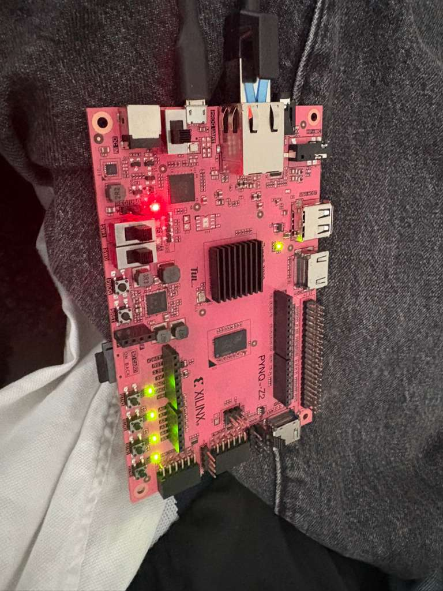

# Sobel Edge Detection Accelerator on FPGA (PYNQ-Z2)

## Overview

This project implements a **hardware-accelerated Sobel edge detection filter** using **Vitis HLS** and deploys it on a **PYNQ-Z2 FPGA board**. The design follows a **streaming architecture (AXI-Stream + DMA)** to achieve **high-throughput, low-latency image processing**.

The accelerator processes grayscale images and outputs edge-detected results using the Sobel operator.

------

## Demo

### FPGA Board (PYNQ-Z2)


### Input vs FPGA Output




------

## System Architecture

The overall dataflow is:

```
DDR (PS)
   ↓
AXI DMA (MM2S)
   ↓
AXI-Stream
   ↓
Sobel Accelerator (PL)
   ↓
AXI-Stream
   ↓
AXI DMA (S2MM)
   ↓
DDR (PS)
```

Inside the accelerator:

```
Input Pixel Stream
      ↓
Line Buffer (2 rows)
      ↓
3×3 Sliding Window
      ↓
Sobel Compute (Gx, Gy)
      ↓
Magnitude (|Gx| + |Gy|)
      ↓
Output Pixel Stream
```

------

## Sobel Operator Design

The Sobel operator computes gradients in X and Y directions:

```
Gx = (right column) - (left column)
Gy = (bottom row) - (top row)
```

Implemented as:

```
Gx = (p02 + 2*p12 + p22) - (p00 + 2*p10 + p20)
Gy = (p20 + 2*p21 + p22) - (p00 + 2*p01 + p02)
```

Final output:

```
Magnitude = |Gx| + |Gy|
Clipped to 8-bit
```

------

## Key Design Ideas

### 1. Streaming Architecture

- No full-frame buffering inside FPGA
- Pixel-by-pixel processing
- Continuous dataflow using `hls::stream`

```
1 pixel in → 1 pixel out (per cycle)
```

------

### 2. Line Buffer + Sliding Window

To avoid storing the full image:

- Two line buffers store previous rows
- A 3×3 window is updated every cycle

This enables:

```
O(1) memory access per pixel
```

------

### 3. AXI-Stream Interface

Using:

```
typedef ap_axiu<8,1,1,1> axis_t;
```

Each pixel is transferred as a packet:

- `data` → pixel value
- `user` → start of frame
- `last` → end of frame

------

## Optimizations

### 1. Pipeline (II = 1)

```
#pragma HLS PIPELINE II=1
```

- Achieves **1 pixel per cycle throughput**
- Core performance bottleneck eliminated

------

### 2. Bitwidth Optimization

Replaced 32-bit integers with:

```
ap_int<12> gx, gy;
ap_uint<12> mag;
```

Reason:

- Sobel max value ≈ 2040
- Reduces LUT usage
- Shortens critical path

------

### 3. Replace Multiplication with Shift

```
(p10 << 1) instead of (2 * p10)
```

Benefits:

- Removes multipliers
- Improves timing
- Reduces hardware cost

------

### 4. Balanced Adder Tree

Instead of long expression chains:

```
gx = right - left;
gy = bottom - top;
```

Helps:

- Reduce combinational depth
- Improve timing closure

------

### 5. Dual-Port BRAM for Line Buffer

```
#pragma HLS BIND_STORAGE type=ram_2p
```

Allows:

- Simultaneous read/write
- Maintains II = 1

------

### 6. AXI Stream Optimization

- Proper use of `user` and `last`
- Eliminates dependency on index tracking

------

## Performance

| Metric           | Value           |
| ---------------- | --------------- |
| Pipeline II      | 1               |
| Throughput       | 1 pixel / cycle |
| Stable Frequency | ~100–125 MHz    |
| Architecture     | Fully streaming |

------

## Software (PYNQ)

Python (Jupyter Notebook) is used to:

- Load overlay
- Transfer data via DMA
- Display results

Example:

```
dma.recvchannel.transfer(out_buf)
dma.sendchannel.transfer(in_buf)

dma.sendchannel.wait()
dma.recvchannel.wait()
```

------

## Project Structure

```
src/
    sobel_top.cpp
    sobel_core.cpp
    window_generator.cpp
    sobel.hpp
    sobel_ref.cpp

tb/
    tb_sobel.cpp

images/
    board.jpg
    result.jpg
```

------

## Key Takeaways

- Streaming design is essential for FPGA performance
- Line buffers enable efficient 2D convolution
- Pipeline II=1 is more important than pushing frequency
- AXI-Stream removes the need for indexing
- Hardware design ≠ software design (no random access)

------

## Future Work

- Multi-pixel per cycle (e.g., 32-bit AXI stream)
- Vectorized Sobel
- Integration with video pipeline
- Real-time camera input

------

## Author

Lixuan Xu
 NYU Tandon School of Engineering